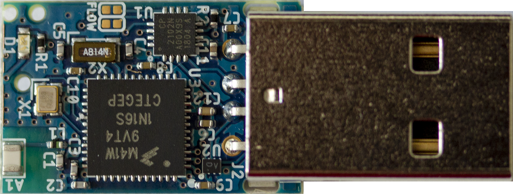

Thread USB Dongle
=================



This repo holds the designs for an IEEE 802.15.4 USB dongle that is compatible
with the thread networking stack and supported by [Openthread](https://github.com/openthread/openthread).
The dongle functions as an NCP mode and is compatible with the OpenThread
[Border Router](https://github.com/openthread/borderrouter).

Currently there are no readily available commercial IEEE USB Thread NCP dongles
for a reasonable cost. This dongle is designed to be inexpensive, consists of
only a USB connector, serial to UART converter, and an 802.15.4 radio SoC.

Hardware designs are located in
[hardware](https://github.com/lab11/thread-dongle/tree/master/hardware), and
firmware is located in
[software](https://github.com/lab11/thread-dongle/tree/master/software).
Firmware is based on the OpenThread NCP implementation.

To clone this repo and submodules:
```
git clone --recursive https://github.com/lab11/thread-dongle.git
```
